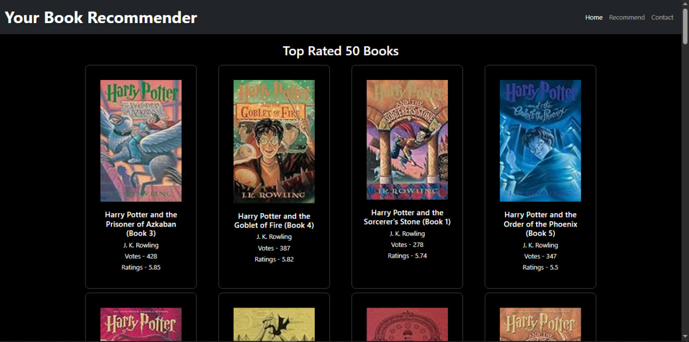
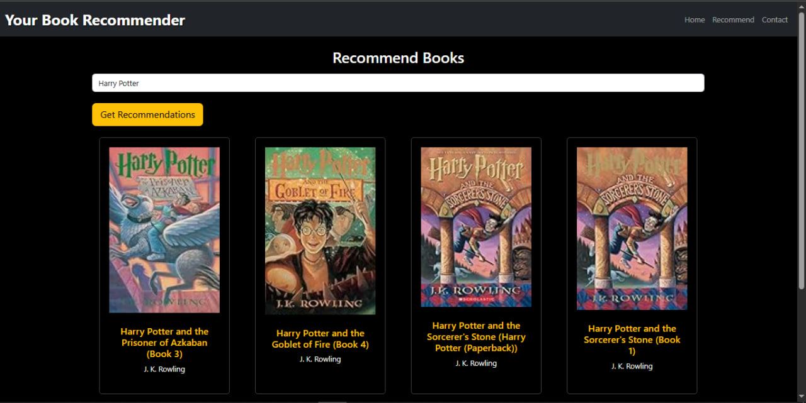
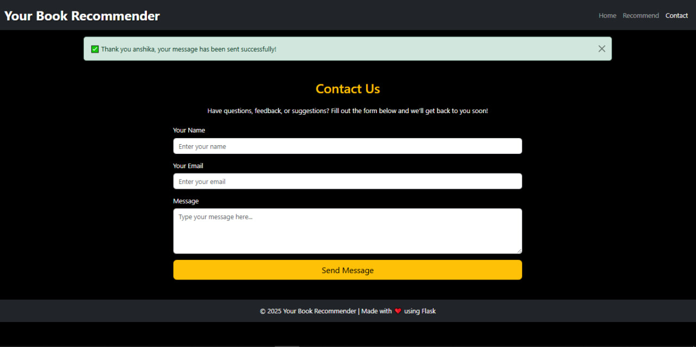

# 📚 Simple – Book Recommender App  

A **Book Recommendation Web Application** built with **Flask, Machine Learning models, and Bootstrap frontend**.  
This project was originally inspired by a **CampusX YouTube course on Machine Learning**, where I learned the fundamentals.  
Later, I added my own improvements to make the app more polished, responsive, and user-friendly 🎉  

## 🌐 Live Demo  
👉 [View App on Render](https://book-recommender-381m.onrender.com)  

## ✨ Features  

- 📖 **Popular Books Section** – Displays most voted & rated books  
- 🔍 **Smart Recommendations** – Suggests similar books based on **cosine similarity + fuzzy matching** (handles typos in search)  
- 📱 **Responsive UI** – Built with **Bootstrap + custom CSS** for smooth experience on mobile, tablet, and desktop  
- 🎨 **Improved Frontend** – Clean design, sidebar with top searches, and consistent theme  
- 📬 **Contact Page** – Users can send feedback with a simple form + flash confirmation message  
- ⚡ **Optimized Backend** – Pre-trained pickle files ensure fast results without heavy computation  
- 🛠️ **Continuous Improvements** – Added fuzzy search, enhanced design, made it device-friendly, and added extra details beyond the original tutorial

## 🛠️ Tech Stack  

**Frontend**:  
- HTML5  
- CSS3  
- Bootstrap 5  
- JavaScript  

**Backend**:  
- Python (Flask Framework)  

**Machine Learning & Data Processing**:  
- Pandas  
- NumPy  
- Pickle / Gzip Pickle  
- FuzzyWuzzy (for smart search matching)  

**Deployment**:  
- Render (Cloud Hosting)  

## 📂 Project Structure  

```
book-recommender/
├── static/                # CSS, JS, Images
├── templates/             # HTML files (index.html, recommend.html, contact.html)
├── app.py                 # Main Flask app
├── boooks.pkl.gz          # Book dataset (compressed pickle)
├── popular.pkl            # Popular books dataframe
├── pt.pkl                 # Pivot table for recommendation
├── similarity\_score.pkl   # Similarity score matrix
├── requirements.txt       # Dependencies
├── Procfile               # For deployment on Render
└── README.md              # Project documentation
```

## ⚙️ Installation & Usage  

Follow these steps to run locally:  

1. **Clone the repository**  
   ```bash
   git clone https://github.com/YOUR_USERNAME/YOUR_REPO_NAME.git
   cd YOUR_REPO_NAME
   ```

2. **(Optional) Create virtual environment**

   ```bash
   python -m venv venv
   source venv/bin/activate   # Linux/Mac  
   venv\Scripts\activate      # Windows  
   ```

3. **Install dependencies**

   ```bash
   pip install -r requirements.txt
   ```

4. **Run the Flask app**

   ```bash
   python app.py
   ```

5. **Open in browser**

   ```
   http://127.0.0.1:5000/
   ```

## 📷 Screenshots

### 🔹 Home Page (Popular Books)

<p float="left">
  
</p>

### 🔹 Recommendation Page

<p float="left">
  
</p>

### 🔹 Contact Page

<p float="left">
  
</p>

## 🚀 Deployment on Render

1. Push project to **GitHub**
2. Connect repo with **Render**
3. Add **Start Command** in `Procfile`:

   ```
   gunicorn app:app
   ```
4. Deploy and get your live URL 🎉


## 🧑‍🎓 Learning Journey

This project started as a **practice exercise** from the **CampusX Machine Learning YouTube series**.

* ✅ I learned how to preprocess datasets and use similarity scores for recommendations
* ✅ Built the base app from the tutorial
* ✅ Then I **added extra improvements** myself:

  * Integrated **FuzzyWuzzy** for typo-tolerant searches
  * Designed a **responsive Bootstrap UI** for all devices
  * Added a **Contact page** with flash messages
  * Enhanced the **overall design, theme, and user experience**

This way, the project became not just a practice exercise but a **complete deployable web app** 🚀

## 👩‍💻 Author

Made with ❤️ by **Anshika**
